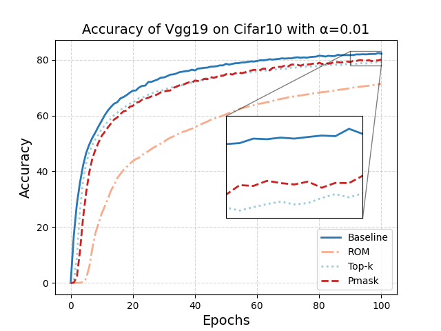

# Permutation Mask: A Combined Gradient Sparsification for Federated Learning

---

## Description

---

This package is an implement for "Permutation Mask: A Combined Gradient Sparsifification for Federated Learning“.  Pmask (Permutation Mask) is a Gradient Sparsifification method. This package provides the analyses of Pmask on Cifar10, mini-ImageNet and SVHN.

## Python Packages

---

* Torch
* Numpy
* MLclf

## Example

---

Run the code

`python main.py -c ./utils/conf.json` 

All the configurations are given in <u>conf.json</u>, you can change them according to actual requirements.

* model_name: the name of model
* no_models: the number of clients
* type: the name of dataset
* global_epochs: global epochs, i.e., the number of communication between the server and clients
* local_epochs: the number of training locally
* k: the number of clients take part in the global training at each epoch
* batch_size: the batch size of local training
* lr, momentum, lambda: hyper-parameters of the local training

## Performance Analysis

---

Here is the comparison with other methods on Cifar10.

## Author

---

Shiqi Zhou, Yongdao Zhou. (School of Statistics and Data Science, Nankai University, 94 Weijin Road, Nankai District, 300071, Tianjin, China)